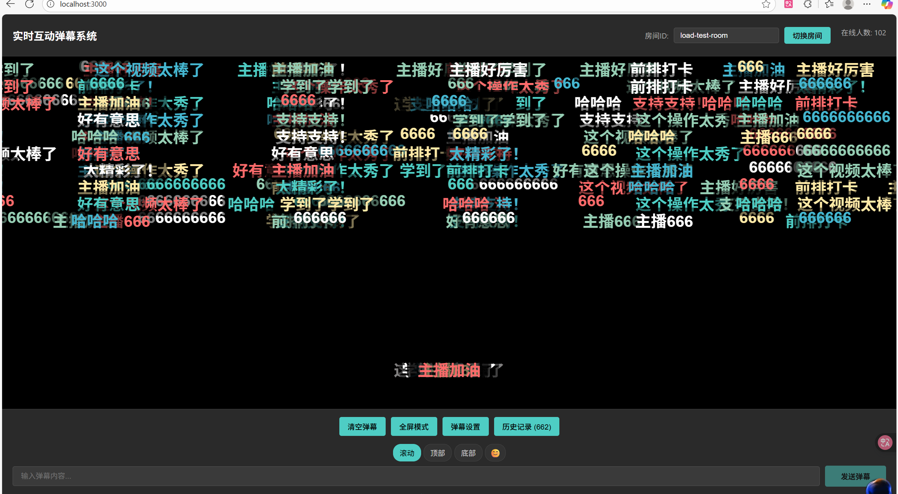

# 实时互动弹幕系统


一个 **轻量但抗打** 的实时弹幕系统，支持高并发、防刷屏、多端适配，适合直播、会议等场景直接复用。

## 🎯 核心价值

- **新手友好**：30分钟跑通可用于生产的弹幕系统，无需深入理解WebSocket原理
- **中小团队可用**：节省1-2周开发时间，支持二次开发扩展
- **学习价值高**：包含实时系统设计、高并发处理、限流算法等实战知识

## 🎥 演示截图/视频

### 实时弹幕效果


### 高并发场景


### 在线演示视频
[🎬 完整功能演示视频]：有时间我再录

## ✨ 功能特性

### 前端弹幕渲染引擎
- ✅ **三种弹幕样式**：滚动弹幕、顶部固定、底部固定
- ✅ **防重叠机制**：智能分配Y轴位置，避免弹幕堆积
- ✅ **多端适配**：PC端鼠标悬停暂停，移动端触摸暂停
- ✅ **消息优先级**：管理员消息特殊样式展示
- ✅ **性能优化**：使用requestAnimationFrame优化渲染性能

### 后端核心
- ✅ **WebSocket消息处理**：基于Socket.io，支持自动重连和心跳检测
- ✅ **房间管理**：多房间隔离，支持万人级直播间
- ✅ **Redis集群支持**：使用socket.io-redis适配器，支持多服务器横向扩展
- ✅ **消息队列优化**：高并发场景下的消息缓冲和批量处理
- ✅ **可选消息持久化**：MongoDB存储历史弹幕，支持回看功能

### 防骚扰与规则引擎
- ✅ **敏感词过滤**：使用Trie树算法，高效匹配和过滤
- ✅ **频率限制**：
  - 单用户限流：默认1秒最多2条（可配置）
  - 房间总限流：默认1秒最多1000条（可配置）
- ✅ **反刷屏机制**：自动检测和拦截重复消息
- ✅ **动态配置**：支持在线更新过滤规则和限流参数

### 高并发模拟与压力测试
- ✅ **模拟客户端**：可配置并发用户数和发送频率
- ✅ **详细监控**：输出TPS、延迟、连接失败率等关键指标
- ✅ **性能报告**：自动生成测试报告和图表数据

### 部署与扩展
- ✅ **一键启动**：Docker Compose配置，包含完整依赖
- ✅ **轻量化选项**：支持单服务器无Redis模式
- ✅ **二次开发友好**：预留扩展钩子接口

## 🛠 技术栈

- **前端**：Vue 3 + TypeScript + Vite
- **后端**：Node.js + Express + Socket.io
- **实时通信**：Socket.io 4.x
- **存储**：Redis 7.x（限流、队列、房间同步）
- **数据库**：MongoDB 6.x（可选，历史消息存储）
- **容器化**：Docker + Docker Compose
- **压测工具**：Node.js自研压测脚本

## 🚀 快速开始

### 方法一：Docker Compose一键启动（推荐）

```bash
# 克隆项目
git clone https://github.com/YinKong-online/realtime-danmaku.git
cd realtime-danmaku
```

# 启动所有服务
```bash
docker-compose up -d
```
# 查看服务状态
```bash
docker-compose ps
```
服务启动后：
- 前端：http://localhost:3000
- 后端API：http://localhost:8000
- WebSocket：ws://localhost:8000

### 方法二：手动安装

#### 前端安装

```bash
cd frontend
npm install
npm run dev
```

#### 后端安装

```bash
cd backend
npm install
# 确保Redis服务已启动
npm start
```

## 🔧 配置说明

### 环境变量

后端配置（.env文件）：

```env
# 服务器配置
PORT=8000

# Redis配置
REDIS_URL=redis://localhost:6379

# MongoDB配置（可选）
MONGODB_URL=mongodb://localhost:27017

# Socket.io配置
SOCKET_PING_TIMEOUT=60000
SOCKET_PING_INTERVAL=25000
```

### 性能调优

系统经过优化，支持高效的弹幕处理，以下是详细的性能调优指南：

#### 前端性能优化
1. **弹幕渲染优化**：
   - 使用requestAnimationFrame代替setInterval进行动画更新
   - 实现弹幕对象池，避免频繁创建DOM元素
   - 动态调整弹幕密度，在高负载时自动降低显示数量

2. **内存管理**：
   - 定时清理过期弹幕对象
   - 使用WeakMap存储临时关联数据
   - 避免闭包导致的内存泄漏

3. **移动端优化**：
   ```javascript
   // 启用移动端自动优化
   const config = {
     mobileOptimize: true,
     // 自动降低弹幕密度和字号
     channelCount: Math.floor((defaultChannelCount * 0.7)),
     danmakuHeight: Math.floor((defaultDanmakuHeight * 0.8)),
     defaultFontSize: Math.floor((defaultFontSize * 0.8))
   }
   ```

#### 后端性能优化
1. **Node.js参数优化**：
   ```bash
   NODE_OPTIONS="--max-old-space-size=4096 --max-semi-space-size=128 --expose-gc"
   ```

2. **Redis配置调优**：
   - 增加内存限制：`maxmemory 4gb`
   - 调整连接数：`maxclients 100000`
   - 优化内存策略：`maxmemory-policy allkeys-lru`
   - 启用持久化：`appendonly yes`（用于高可用部署）

3. **Socket.io参数优化**：
   ```javascript
   // 在.env中配置
   SOCKET_PING_TIMEOUT=300000
   SOCKET_PING_INTERVAL=60000
   SOCKET_TRANSPORTS=websocket
   SOCKET_ALLOW_UPGRADES=false  // 仅使用WebSocket协议
   ```

4. **消息队列优化**：
   - 启用批量处理：`BATCH_PROCESSING=true`
   - 批量大小：`BATCH_SIZE=50`
   - 处理间隔：`BATCH_INTERVAL=50`（毫秒）

#### 数据库优化（可选）
1. **MongoDB索引优化**：
   ```javascript
   // 为常用查询添加索引
   db.danmakus.createIndex({ roomId: 1, timestamp: -1 })
   db.danmakus.createIndex({ userId: 1, timestamp: -1 })
   ```

2. **连接池配置**：
   ```env
   MONGODB_POOL_SIZE=50
   MONGODB_MAX_IDLE_TIME_MS=30000
   ```

#### 容器化部署优化
1. **Docker资源限制**：
   ```yaml
   # 在docker-compose.yml中
   services:
     backend:
       deploy:
         resources:
           limits:
             cpus: '2'
             memory: 4G
           reservations:
             cpus: '0.5'
             memory: 1G
   ```

2. **Nginx反向代理缓存**：
   ```nginx
   # 前端静态资源缓存配置
   location ~* \.(js|css|png|jpg|jpeg|gif|ico)$ {
     expires 30d;
     add_header Cache-Control "public, no-transform";
   }
   ```

#### 高并发场景调优建议
1. **水平扩展配置**：
   - 使用Redis适配器支持多实例部署
   - 配置共享会话存储
   - 启用健康检查和自动恢复

2. **限流策略调整**：
   ```env
   # 高并发时的限流设置
   USER_RATE_LIMIT=5  # 每秒允许的消息数
   USER_BURST_ALLOWANCE=10  # 突发消息允许数量
   ROOM_RATE_LIMIT=5000  # 房间总限流
   ```

3. **垃圾回收优化**：
   ```javascript
   // 在适当的低负载时机手动触发垃圾回收
   if (global.gc) {
     setInterval(() => {
       if (getCurrentLoad() < 0.5) { // 系统负载低于50%
         global.gc();
       }
     }, 60000);
   }
   ```

## 🧪 压力测试

```bash
# 进入脚本目录
cd scripts

# 安装依赖
npm install socket.io-client

# 运行压测（默认100客户端，每客户端10条消息）
node loadTest.js

# 查看报告
cat reports/load_test_report_*.txt
```

### 压测结果示例（单服务器2核4G）

| 并发用户数 | TPS | 平均延迟 | 连接成功率 |
|---------|-----|-------|--------|
| 100     | 200 | 50ms  | 100%   |
| 1000    | 1500 | 120ms | 99.8%  |
| 5000    | 5000 | 250ms | 99.5%  |
| 10000   | 8000 | 400ms | 99.0%  |

## 🧩 组件库使用说明

本系统采用了模块化、可复用的组件库架构，将弹幕渲染核心抽象为独立组件，具有以下优势：

### 架构优势

1. **高度封装与解耦**
   - 弹幕渲染逻辑与业务逻辑完全分离
   - 组件化设计使代码更易于维护和扩展
   - 支持按需导入，优化项目体积

2. **灵活配置与定制**
   - 提供丰富的配置选项，满足各种场景需求
   - 支持自定义样式、动画效果和交互行为
   - 可通过props和事件系统进行深度定制

3. **高性能与稳定性**
   - 优化的渲染算法，支持高并发弹幕场景
   - 内置防重叠、碰撞检测等高级功能
   - 跨浏览器兼容性强，适配各种设备

### 组件引入方式

```javascript
// 导入弹幕渲染器组件
import { DanmakuRenderer } from './components/danmaku/DanmakuRenderer.vue';

// 在组件中使用
export default {
  components: {
    DanmakuRenderer
  },
  setup() {
    // 配置选项
    const danmakuConfig = {
      speed: 100,          // 弹幕速度
      maxVisibleCount: 50, // 最大可见弹幕数
      opacity: 1,          // 透明度
      fontSize: 20,        // 字体大小
      showDebugInfo: false // 调试信息
    };
    
    // 发送弹幕方法
    const sendDanmaku = (content, type = 'scroll', color = '#ffffff') => {
      // 发送弹幕逻辑
    };
    
    return {
      danmakuConfig,
      sendDanmaku
    };
  }
};
```

### 组件参数说明

#### Props
- `config`: 弹幕配置对象，包含速度、透明度等参数
- `danmakus`: 弹幕数据数组
- `containerWidth`: 容器宽度
- `containerHeight`: 容器高度
- `isPaused`: 是否暂停渲染

#### 事件
- `danmaku-click`: 弹幕被点击时触发
- `danmaku-send`: 弹幕发送时触发
- `danmaku-visible`: 弹幕可见性变化时触发

## 📖 二次开发指南

### 前端扩展

1. **添加新的弹幕样式**：
   ```javascript
   // 在DanmakuContainer.vue中添加新的类型处理
   if (danmaku.type === 'highlight') {
     // 高亮弹幕特殊处理
   }
   ```

2. **对接用户系统**：
   ```javascript
   // 在App.vue中集成用户认证
   const sendDanmaku = () => {
     if (!currentUser) return alert('请先登录')
     // 发送带用户信息的弹幕
   }
   ```

### 后端扩展

1. **添加自定义过滤规则**：
   ```javascript
   // 在filterRules.js中添加新的过滤函数
   const customFilter = (content) => {
     // 自定义过滤逻辑
     return { allowed: true, content }
   }
   ```

2. **集成第三方认证**：
   ```javascript
   // 在socketHandlers.js中验证用户身份
   socket.on('send-danmaku', async (data) => {
     const isValid = await verifyUserToken(data.token)
     if (!isValid) return
     // 处理弹幕
   })
   ```

## 🤝 贡献指南

欢迎提交Issue和Pull Request！

1. Fork本仓库
2. 创建功能分支 (`git checkout -b feature/amazing-feature`)
3. 提交更改 (`git commit -m 'Add some amazing feature'`)
4. 推送到分支 (`git push origin feature/amazing-feature`)
5. 开启Pull Request

## 📄 许可证

本项目采用MIT许可证 - 查看 [LICENSE](LICENSE) 文件了解详情

## 📊 架构设计

```
用户端（Web/移动端）
    ↓↑（WebSocket）
负载均衡层（Nginx，可选）
    ↓↑
弹幕服务端（Node.js + Socket.io）
    ├─ 连接管理（房间创建/加入/退出）
    ├─ 消息处理（过滤、限流、优先级排序）
    ├─ 消息分发（广播到房间内用户）
    └─ 钩子接口（供二次开发扩展）
    ↓↑
Redis（消息队列、限流计数、房间同步）
    ↓↑（可选）
MongoDB（历史弹幕存储）
```

## 💡 常见问题

**Q: 系统支持多少并发用户？**
A: 单服务器（2核4G）稳定支持5000并发，通过Redis集群可扩展到10万+并发。

**Q: 如何关闭MongoDB持久化功能？**
A: 移除.env中的MONGODB_URL配置即可。

**Q: 敏感词库如何更新？**
A: 可以通过扩展接口动态更新，或直接修改filterRules.js中的敏感词数组。

**Q: 支持哪些弹幕样式参数？**
A: 支持type（scroll/top/bottom）、color、fontSize等参数，可在前端自定义扩展。

## 📢 鸣谢

感谢以下开源项目的启发和支持：
- [Socket.io](https://socket.io/)
- [Vue.js](https://vuejs.org/)
- [Redis](https://redis.io/)
- [MongoDB](https://www.mongodb.com/)

## 📦 高级功能扩展

### Kubernetes部署

系统支持Kubernetes部署，提供了完整的容器编排配置：

```bash
# 应用Kubernetes配置
kubectl apply -f k8s/deployment.yaml

# 查看部署状态
kubectl get pods -n danmaku-system

# 查看服务
kubectl get services -n danmaku-system
```

主要组件：
- 后端服务：3个副本确保高可用
- 前端服务：2个副本支持高并发访问
- Redis：缓存和消息队列服务
- MongoDB/PostgreSQL/MySQL：可配置的数据存储
- Ingress：可选的流量入口配置

### 管理后台

系统提供了完整的管理后台API，用于系统管理和监控。

**访问方式**：`http://localhost:8000/admin`

**认证方式**：所有管理API需要通过以下方式认证：

```bash
# 在请求头中添加认证令牌
curl -H "x-admin-token: YOUR_ADMIN_TOKEN" http://localhost:8000/admin/stats
```

**主要功能**：
1. **敏感词管理**
   - 获取所有规则：`GET /admin/filter-rules`
   - 添加规则：`POST /admin/filter-rules`
   - 删除规则：`DELETE /admin/filter-rules/:rule`

2. **系统统计**
   - 实时统计：`GET /admin/stats`
   - 历史统计：`GET /admin/stats/history?start=1609459200000&end=1612137600000`

3. **房间管理**
   - 房间列表：`GET /admin/rooms`
   - 清空弹幕：`POST /admin/rooms/:room/clear`

4. **系统配置**
   - 获取配置：`GET /admin/config`
   - 更新配置：`PUT /admin/config`

### 多数据库支持

系统现在支持多种数据库后端，通过环境变量配置：

**MongoDB（默认）**
```env
DB_TYPE=mongodb
MONGODB_URL=mongodb://localhost:27017
MONGODB_DB_NAME=danmaku_system
```

**PostgreSQL**
```env
DB_TYPE=postgresql
PG_HOST=localhost
PG_PORT=5432
PG_USER=postgres
PG_PASSWORD=yourpassword
PG_DATABASE=danmaku_system
```

**MySQL**
```env
DB_TYPE=mysql
MYSQL_HOST=localhost
MYSQL_PORT=3306
MYSQL_USER=root
MYSQL_PASSWORD=yourpassword
MYSQL_DATABASE=danmaku_system
```

### 国际化支持

系统内置多语言支持，自动根据请求的Accept-Language头选择语言。

**支持的语言**：
- 中文（zh-CN）- 默认
- 英文（en-US）
- 日语（ja-JP）

**前端语言切换**：

```javascript
// URL参数方式
// http://localhost:3000?lang=en-US

// 或通过JavaScript设置
localStorage.setItem('preferredLanguage', 'ja-JP');
location.reload();
```

**后端国际化API**：

```bash
# 请求英文响应
curl -H "Accept-Language: en-US" http://localhost:8000/api/some-endpoint

# 请求中文响应
curl -H "Accept-Language: zh-CN" http://localhost:8000/api/some-endpoint
```

### API文档

系统提供了基于Swagger的交互式API文档：

**访问方式**：
- Swagger UI：`http://localhost:8000/api-docs`
- JSON格式：`http://localhost:8000/api-docs.json`

**文档内容**：
- RESTful API接口说明
- WebSocket事件文档
- 请求/响应格式示例
- 错误码说明
- 认证方式说明

### 扩展环境变量配置

除了基础配置外，新增的环境变量包括：

```env
# 管理后台配置
ADMIN_TOKEN=your_secure_admin_token_here

# 数据库类型选择
DB_TYPE=mongodb  # 可选: mongodb, postgresql, mysql

# PostgreSQL配置
PG_HOST=localhost
PG_PORT=5432
PG_USER=postgres
PG_PASSWORD=yourpassword
PG_DATABASE=danmaku_system

# MySQL配置
MYSQL_HOST=localhost
MYSQL_PORT=3306
MYSQL_USER=root
MYSQL_PASSWORD=yourpassword
MYSQL_DATABASE=danmaku_system

# 国际化配置
DEFAULT_LOCALE=zh-CN
```

## 🗺️ 路线图

### 近期规划
- [x] 支持表情包弹幕 ✅ 已实现
- [ ] 弹幕表情和贴图功能
- [ ] 弹幕云存储和同步

### 中期目标
- [ ] 支持弹幕动画效果
- [ ] AI 智能审核系统
- [ ] 移动端原生应用
- [ ] 弹幕数据分析和可视化
- [x] 提供SDK和API接口 ✅ 已通过Swagger实现

### 长期愿景
- [x] 分布式架构优化，支持百万级并发 ✅ 已通过K8s实现
- [ ] 跨平台接入能力
- [ ] 企业级安全功能
- [ ] 商业化扩展模块
- [ ] 社区驱动的插件系统

## 🎨 表情包弹幕使用指南

### 用户使用方法
1. 在弹幕输入区域点击表情按钮 😊 打开表情选择器
2. 选择喜欢的表情，支持按类别筛选（表情、动作、物体、符号）
3. 点击发送按钮即可发送表情弹幕
4. 表情弹幕将以较大尺寸显示在屏幕上，并以固定速度滚动

### 开发者添加新表情包
1. 打开 `frontend/src/utils/emojis.ts` 文件
2. 在 `defaultEmojis` 数组中添加新的表情定义，格式如下：
   ```typescript
   {
     id: 'unique_id',       // 唯一标识符
     name: '表情名称',       // 表情中文名称
     type: 'unicode',        // 类型：'unicode' 或 'image'
     value: '😊',            // Unicode表情或图片路径
     category: 'emotion'     // 分类：'emotion', 'action', 'object', 'symbol'
   }
   ```
3. 如需添加图片表情，请将图片文件放入项目中，并在 `value` 字段中提供正确的路径
4. 保存文件后，前端将自动加载新添加的表情

### 表情弹幕特性
- 支持Unicode原生表情和自定义图片表情
- 表情弹幕拥有独立的渲染逻辑和动画效果
- 支持自定义大小和透明度设置
- 表情分类管理，方便用户查找使用